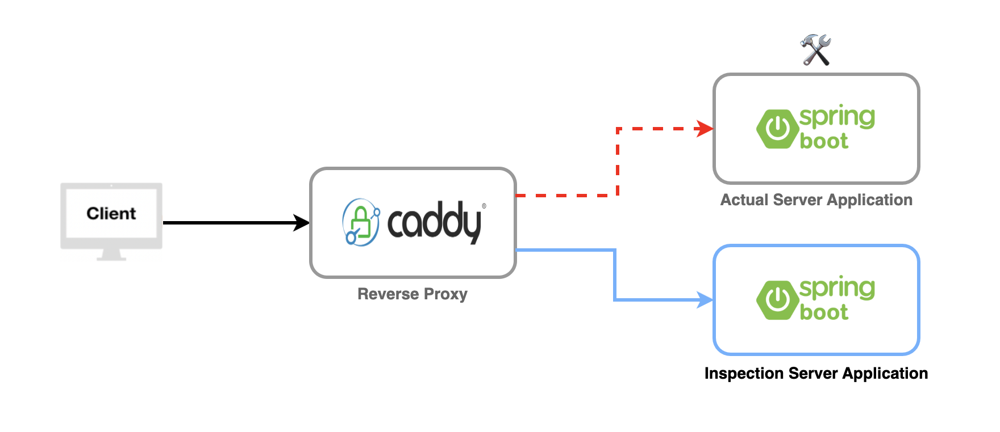

# Inspection

### When a server application is going through an inspection or maintenance, a reverse proxy such as Nginx or Caddy should direct to this server application endpoint to notify its current status.

## Architecture

